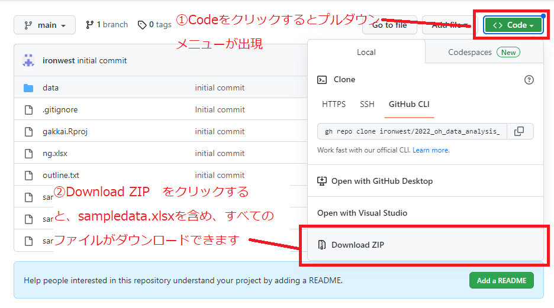

## Readme

sampledata.xlsxが動画で解説した分析を行うための資料となっています。

## ファイルのダウンロード方法

右上の緑色のCodeボタンから、ZIPファイルをダウンロードできます

## Q&A

* 他のファイルは何ですか？

解説するのに利用したファイル等です。動画の内容に沿うために必要なものはsampledata.xlsxファイルだけなので、他は消していただいて構いません。

* もう少し詳しく説明がききたい

動画の最初のスライドにメールアドレスを掲載しておりますので、そちらから個別に連絡いただいてもかまいません（ただし、ご質問の内容によっては対応できないこともあること、ご了承ください）